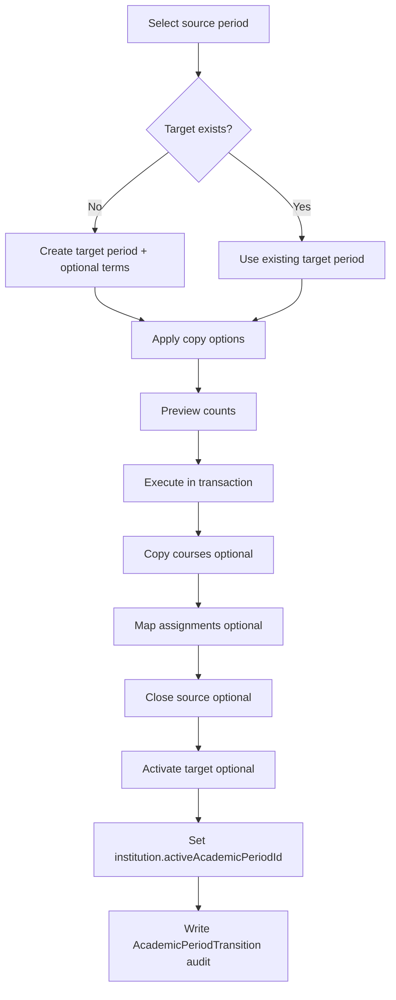

# Academic period transitions

## Purpose

Allows administrators to move an institution from one **school year** to the next (e.g. `2025-2026` → `2026-2027`) without manually recreating reusable catalog data or losing historical records.

## Design principles

| Principle | Implementation |
|-----------|----------------|
| Historical integrity | Source period rows are never overwritten; new rows are created in the target period |
| Period isolation | Courses and teacher assignments are scoped by `academicPeriodId` |
| Reusable structure | `AcademicLevel`, `GradeLevel`, and `Subject` catalog entries are shared (not duplicated) |
| One active period per institution | `Institution.activeAcademicPeriodId` points to the operational period |
| Auditable transitions | `AcademicPeriodTransition` records who executed what was copied |

## Data model

### Institution.activeAcademicPeriodId

Optional FK on `Institution` → `AcademicPeriod`. Defines the institution's current operational year regardless of regime-level `isActive` flags on periods.

### AcademicPeriodTransition (audit)

| Column | Type | Notes |
|--------|------|-------|
| `id` | UUID | Primary key |
| `institutionId` | UUID | FK → Institution |
| `fromAcademicPeriodId` | UUID | Source period |
| `toAcademicPeriodId` | UUID | Target period |
| `executedById` | UUID | FK → User (admin) |
| `copiedCourses` | Boolean | Classroom groups copied |
| `copiedAssignments` | Boolean | Teacher assignments copied |
| `copiedStructures` | Boolean | Always true when reusable catalog is referenced (not duplicated) |
| `copiedTerms` | Boolean | Academic terms copied into new target |
| `createdAt` | DateTime | Audit timestamp |

## Transition workflow

### Copy options

| Option | Default | Behavior |
|--------|---------|----------|
| `copyCourses` | true | New `Course` rows in target period (same grade/subject links) |
| `copyTeacherAssignments` | false | New assignments pointing to mapped courses (requires `copyCourses`) |
| `copyTerms` | true | Copy `AcademicTerm` rows when creating a new target period |
| `activateTargetPeriod` | true | Set target `ACTIVE`, update institution active period |
| `closeSourcePeriod` | true | Set source to `CLOSED` |

### Preview endpoint

`POST /v1/institutions/:institutionId/academic-transitions/preview` returns source counts, estimated copies, and reusable structure totals **without mutating data**.

## API (`/v1/institutions/:institutionId/academic-transitions`)

| Method | Path | Roles | Description |
|--------|------|-------|-------------|
| GET | `/active-period` | SUPER_ADMIN, ADMIN, TEACHER | Current active period for institution |
| PUT | `/active-period` | SUPER_ADMIN, ADMIN | Set active period explicitly |
| GET | `/` | SUPER_ADMIN, ADMIN, TEACHER | Transition history (paginated) |
| POST | `/preview` | SUPER_ADMIN, ADMIN | Dry-run summary |
| POST | `/execute` | SUPER_ADMIN, ADMIN | Run transition |

OpenAPI tag: `academic-period-transitions`.

## Business rules

1. Source and target periods must belong to the same `institutionId`.
2. Target period must not already be `ACTIVE` for another conflicting transition unless explicitly handled.
3. `copyTeacherAssignments` requires `copyCourses` so course mapping exists.
4. Historical periods remain queryable for reports and transcripts.
5. Only authorized admins (`SUPER_ADMIN`, `ADMIN`) may execute transitions.

## Logging

Structured events on `AcademicPeriodTransitionsService`:

- `ACADEMIC_TRANSITION_PREVIEW`, `ACADEMIC_TRANSITION_EXECUTED`
- `ACADEMIC_TRANSITION_FAILED`, `ACADEMIC_ACTIVE_PERIOD_SET`
- `ACADEMIC_TRANSITION_VALIDATION_FAILED`

## Frontend

| Route | Feature |
|-------|---------|
| `/institutions/[id]/transitions` | `academic-period-transitions` |

UI: active period card, multi-step wizard, preview panel, transition history table.

Permissions: `canViewAcademicTransitions`, `canManageAcademicTransitions`.

## Scalability notes

- Transition work runs in a **single Prisma transaction** per execution.
- Course copy uses batched creates with ID mapping for assignment remapping.
- Large institutions may later move to background jobs; audit row is written after success today.
- Regime-agnostic period names — not tied to Ecuador-only assumptions beyond default regime enums.
