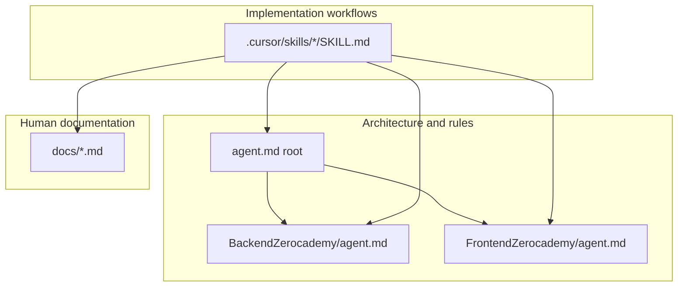

# AI Workflow Architecture

How Cursor agents should use Zerocademy guidance: **agent files for rules**, **skills for workflows**, **docs for humans**.

## Three layers

| Layer | Path | Purpose |
|-------|------|---------|
| **Agent guides** | `agent.md`, `*/agent.md` | Principles, boundaries, naming, security — stable, concise |
| **Skills** | `.cursor/skills/<name>/SKILL.md` | Repeatable tasks: scaffold module, sync API types, commit message |
| **Docs** | `docs/` | Feature specs, RBAC, database, conventions for humans and agents |

## Agent responsibilities

**Root `agent.md`**

- Domain registry (single source of folder names)
- Monorepo principles and FE/BE boundary
- Shared naming and API contract
- Agent behavior and skill index pointer

**`BackendZerocademy/agent.md`**

- NestJS layer rules, RBAC decorator constraints, Prisma principles
- API response and Swagger requirements (summary)
- Backend naming and anti-patterns

**`FrontendZerocademy/agent.md`**

- Feature-slice architecture, RSC rules, state rules
- Spanish UI requirement
- Theme/dark-light via design tokens

Agents must **not** duplicate full scaffolding checklists in agent files — use skills.

## Skill responsibilities

Skills are invoked when the user (or task) requires **implementation**, not when only **explaining** architecture.

Each skill:

1. Lists **prerequisites** (which `agent.md` / `docs/` to read first)
2. Defines **inputs**, **workflow**, **expected output**
3. Lists **anti-patterns**

See [cursor-skills.md](./cursor-skills.md) for the full catalog.

## Recommended agent flow

1. **Classify task** — backend, frontend, schema, docs, or review?
2. **Read** root `agent.md` + layer `agent.md`.
3. **Load skill(s)** matching the task (e.g. new module → `backend-module-generator` + `rbac-security-skill` + `documentation-sync-skill`).
4. **Implement** with minimal diff; align with domain registry.
5. **Review** with `architecture-review-skill` before handoff.
6. **Commit** only when user asks — use `commit-message-skill`.

## Cursor best practices

- Prefer **one skill chain** per feature (Prisma → backend module → frontend feature → docs).
- Keep agent files **short**; extend skills when workflows repeat.
- After API changes, always run **api-frontend-sync-skill**.
- Verify Swagger at `/api/docs` after backend routes change.
- UI copy in **Spanish**; code and docs in **English**.

## Related

- [cursor-skills.md](./cursor-skills.md)
- [development-workflow.md](./development-workflow.md)
- [architecture.md](./architecture.md)
