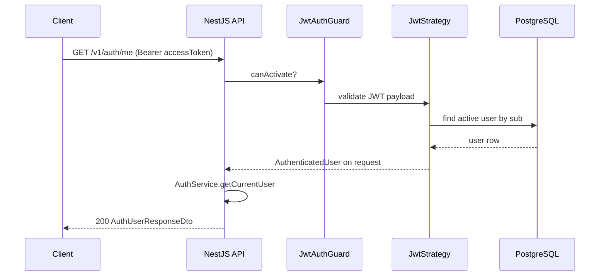
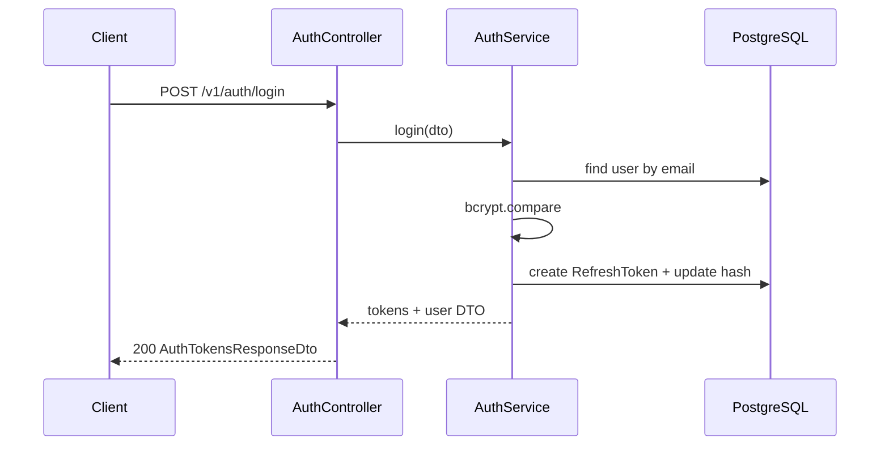
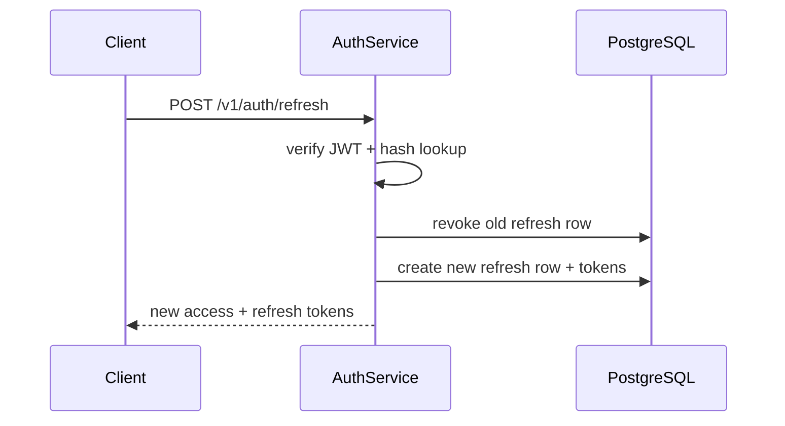
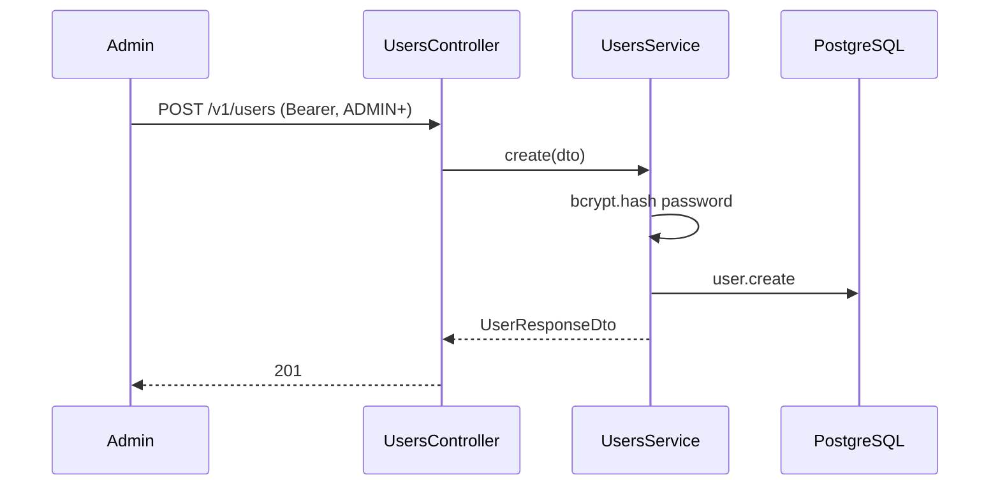

# API flows

## Authenticated request



## Login



## Refresh token rotation



## Create user (admin)



## Error envelope

All HTTP errors use:

```json
{
  "statusCode": 400,
  "message": "Validation failed",
  "error": "Bad Request",
  "details": [{ "field": "email", "message": "email must be an email" }]
}
```

Prisma `P2002` → `409 Conflict`; `P2025` → `404 Not Found` (handled in services where applicable).
