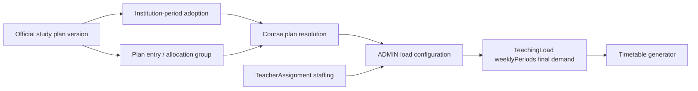

# MINEDUC study-plan catalog — architecture design

Status: **implemented foundation (DEMY-147); no TeachingLoad workflow or UI is included.**
Tracking: [DEMY-147](https://emilioandresalcivarcarrera.atlassian.net/browse/DEMY-147), which blocks [DEMY-136](https://emilioandresalcivarcarrera.atlassian.net/browse/DEMY-136).

## Implemented catalog

The backend now implements `OfficialStudyPlan → OfficialStudyPlanEntry / OfficialStudyPlanAllocationGroup → InstitutionStudyPlanAdoption`.
`SubjectGradeLevel` remains generic curriculum applicability and `TeachingLoad.weeklyPeriods` remains the final operational timetable requirement.

The released catalog is internal code `EC_ORDINARY_EGB`, version `2023-00008-A`, scope `ORDINARY_EGB`, sourced from `MINEDUC-MINEDUC-2023-00008-A`. It covers canonical EGB 8–10 grades and seven directly mapped subjects. The complementary three-period block is retained as a `REFERENCE_ONLY` allocation group because its official activities do not map one-to-one to current Subjects. No unsupported preparatoria, elemental/media, or BGU allocation is asserted.

Official rows have no write API. A later regulation is a new `(code, version)` record. `npm run prisma:seed:official-study-plans -w backend-zerocademy` is production-only: it creates missing curated facts and throws on any conflicting existing immutable version; it never updates plans, creates adoption rows, or invokes demo/QA seeds.

Adoption is explicit and unique by institution, academic period, and applicability scope. Only an ADMIN with active membership can adopt; CLOSED/ARCHIVED periods reject mutation; existing institutions are not auto-adopted. API: `GET /v1/study-plans`, `GET /v1/study-plans/:studyPlanId`, and the institution-period adoption routes.

### Production deployment verification

Migration `20261006130000_official_study_plans` was deployed to the direct Neon
`Zerocademy` database on 2026-10-06. It is additive: two enums, four tables,
indexes/uniqueness constraints, and `RESTRICT` foreign keys only. The isolated
official seed was executed twice with stable results: one plan, 21 entries,
three allocation groups, and zero institution adoptions. Existing academic and
timetable-domain counts were unchanged. The plan entries resolve only canonical
`EGB-8`, `EGB-9`, and `EGB-10` grades and canonical Subject codes.

## Purpose

Zerocademy needs a system-owned, versioned reference catalog for official MINEDUC study plans. It supplies official context for configuring operational teaching loads without making the timetable domain a curriculum engine.

The generator consumes finalized `TeachingLoad.weeklyPeriods`, never MINEDUC documents or reference data directly.

## Official findings and applicability

The legal base is [MINEDUC-MINEDUC-2023-00008-A](https://educacion.gob.ec/wp-content/uploads/downloads/2023/03/MINEDUC-MINEDUC-2023-00008-A.pdf), as amended where applicable by [MINEDEC-MINEDEC-2025-00051-A](https://educacion.gob.ec/wp-content/plugins/download-monitor/download.php?force=1&id=23072).

| Rule                                                                                       | Applicability                            | Classification                      | Design consequence                                                                |
| ------------------------------------------------------------------------------------------ | ---------------------------------------- | ----------------------------------- | --------------------------------------------------------------------------------- |
| EGB publishes minimum weekly periods; some allocations span several subjects.              | Applicable ordinary EGB course/sublevel. | MINIMUM                             | Represent direct subject requirements and shared allocation groups.               |
| Bachillerato en Ciencias has course-specific minimums.                                     | Ordinary Bachillerato, Ciencias offer.   | MINIMUM / DEFAULT_EDITABLE          | Version and resolve by course/subject.                                            |
| Bachillerato Técnico has a separate plan, reformed in 2025, with permitted redistribution. | Técnico only.                            | MINIMUM with bounded redistribution | Support the model shape, but do not seed/expose Técnico figures in immediate MVP. |
| Institutions may distribute values only where the source permits it.                       | Per explicit plan rule.                  | DEFAULT_EDITABLE or FLEXIBLE_POOL   | Show source and validate; do not invent a fixed per-subject value.                |
| Inicial uses ejes/ámbitos, not the ordinary EGB subject plan.                              | Educación Inicial.                       | OFFICIAL_REFERENCE                  | Do not derive ordinary subject loads for Inicial.                                 |

## Proposed domain model

Use `OfficialStudyPlan`, avoiding ambiguity with existing teacher-owned `AcademicPlan`.

| Model                              | Important fields                                                                                                          | Responsibility                                     |
| ---------------------------------- | ------------------------------------------------------------------------------------------------------------------------- | -------------------------------------------------- |
| `OfficialStudyPlan`                | `id`, internal `code`, `name`, source title/URL/issued date, effective range, status, `offerKey?`                         | Immutable system reference version and provenance. |
| `OfficialStudyPlanEntry`           | plan, `gradeLevelId`, `subjectId`, `valuePolicy`, optional default/minimum periods, `allocationGroupKey?`, source locator | Subject applicability and directly stated value.   |
| `OfficialStudyPlanAllocationGroup` | plan, grade, key/name, `valuePolicy`, optional default/minimum periods, source locator                                    | Shared allocation distributed among entries.       |
| `InstitutionStudyPlanAdoption`     | institution, academic period, official plan, adopted/locked timestamps and actor                                          | Historical selection for one institution-period.   |

`valuePolicy` is `FIXED`, `MINIMUM`, `DEFAULT_EDITABLE`, `FLEXIBLE_POOL`, or `REFERENCE_ONLY`. Numeric fields are nullable because a source does not always establish a separately enforceable number. No `CurriculumArea` model is needed: `allocationGroupKey` is a plan-local numeric grouping, not a reusable curriculum-area catalog.

## Resolution and versioning

1. A platform curator adds a new immutable plan version and source metadata; old versions are never overwritten or deleted.
2. At institution-period setup, the institution adopts each applicable plan (immediate scope: ordinary EGB and Bachillerato en Ciencias).
3. Course resolution uses `institutionId`, `academicPeriodId`, and `gradeLevelId` to find the adopted plan and entry.
4. Adoption locks once an operational load is confirmed or a timetable is published. Replacement requires explicit reconciliation and never rewrites historical loads, schedules, grades, or reports.

Effective dates guide selection; the explicit adoption is the historical record. Thus a 2026–2027 period keeps plan version A after MINEDUC publishes version B.

### Education offer

Do **not** introduce a standalone `EducationOffer` model in the immediate EGB and Bachillerato en Ciencias MVP. `OfficialStudyPlan.offerKey` suffices because current Course/Institution data has no offer field and Técnico is out of scope. Introduce a true offer model before supporting Técnico or parallel Ciencias/Técnico courses for one grade.

## Existing-domain decisions

### SubjectGradeLevel — KEEP

`SubjectGradeLevel` remains the editable generic subject-applicability link used by current catalog and teacher-assignment validation. It must not contain legal source, effective dates, minimums, or plan-version data. Official entries refer to `Subject` and `GradeLevel` separately.

### CurriculumArea — KEEP_DEFERRED

The plan-local allocation group represents only numeric constraints. It does not introduce a curriculum-area domain or change subject-first assignment/reporting.

### TeacherAssignment and TeachingLoad

`TeacherAssignment` remains staffing: teacher + subject + course + period. A resolved official entry may suggest a load but never creates staffing. `TeachingLoad.weeklyPeriods` stores only the **final operational weekly demand for timetable placement**; it stores no source, minimum, plan code, or regulatory snapshot.

## DEMY-136 ADMIN workflow

1. ADMIN selects institution and academic period.
2. The service resolves adopted official plan entries by course grade.
3. Each teacher assignment shows subject, source/version, official default or minimum, configured value, and validation state.
4. ADMIN accepts a default or makes an allowed override with a reason.
5. Before generation, the system reports missing official subjects, unstaffed assignments, and incomplete flexible pools. The generator receives final loads only.

### Missing assignments and custom subjects

`NO_TEACHER_ASSIGNMENT` is a configuration **error** when an applicable plan requires a subject/allocation but a course has no matching TeacherAssignment. Do not create a teacher or load; block timetable generation for that course until staffing is corrected or an authorized exception is recorded.

Institution electives remain schedulable. Their assignment can receive a TeachingLoad with `CUSTOM_SUBJECT` / `NO_OFFICIAL_REFERENCE` as **info**. They are never excluded just because the national catalog lacks an entry.

## Validation contract

| Code                         | Severity | Action                                                              |
| ---------------------------- | -------- | ------------------------------------------------------------------- |
| `VALID`                      | success  | Final load satisfies its applicable rule.                           |
| `BELOW_OFFICIAL_MINIMUM`     | error    | Reject when a source-backed minimum applies.                        |
| `FIXED_VALUE_MISMATCH`       | error    | Reject only where source expressly fixes a value.                   |
| `FLEXIBLE_POOL_UNSATISFIED`  | error    | Shared allocation is incomplete before generation.                  |
| `MISSING_REQUIRED_SUBJECT`   | error    | No compatible catalog/assignment path for official subject.         |
| `NO_TEACHER_ASSIGNMENT`      | error    | Required subject is unstaffed; block generation.                    |
| `CUSTOM_SUBJECT`             | info     | Institution subject has no national entry.                          |
| `NO_OFFICIAL_REFERENCE`      | info     | Authorized operational value is needed without numeric source rule. |
| `DEFAULT_OVERRIDDEN`         | warning  | Editable default changed; retain reason/audit metadata.             |
| `INCOMPATIBLE_GRADE_SUBJECT` | error    | Assignment cannot resolve for selected plan.                        |

## Reference-data strategy

**Recommended strategy: application-managed, curated system reference catalog with idempotent release seeds.**

A new MINEDUC version is a reviewed, idempotent reference-data release. It does not edit applied migrations or destructively update an old plan. Every entry records primary source URL, issued/effective dates, offer scope, and a source locator. No external synchronization is part of MVP.

`SUPER_ADMIN` curates the system catalog under a dedicated platform capability. Institution `ADMIN` may read the reference and configure permitted operational values in institutional scope, but cannot edit official values. `SUPER_ADMIN` does not become an institution timetable operator.

## Handoff

DEMY-147 delivers catalog, resolution, and validation. [DEMY-136](https://emilioandresalcivarcarrera.atlassian.net/browse/DEMY-136) then configures operational TeachingLoads; DEMY-138 consumes final loads. DEMY-135 remains independent because schedule blocks are institution-period configuration, not curriculum reference data.

Non-goals: TeachingLoad configuration/UI, curriculum areas/destrezas, Técnico
figures, and external MINEDUC synchronization.
