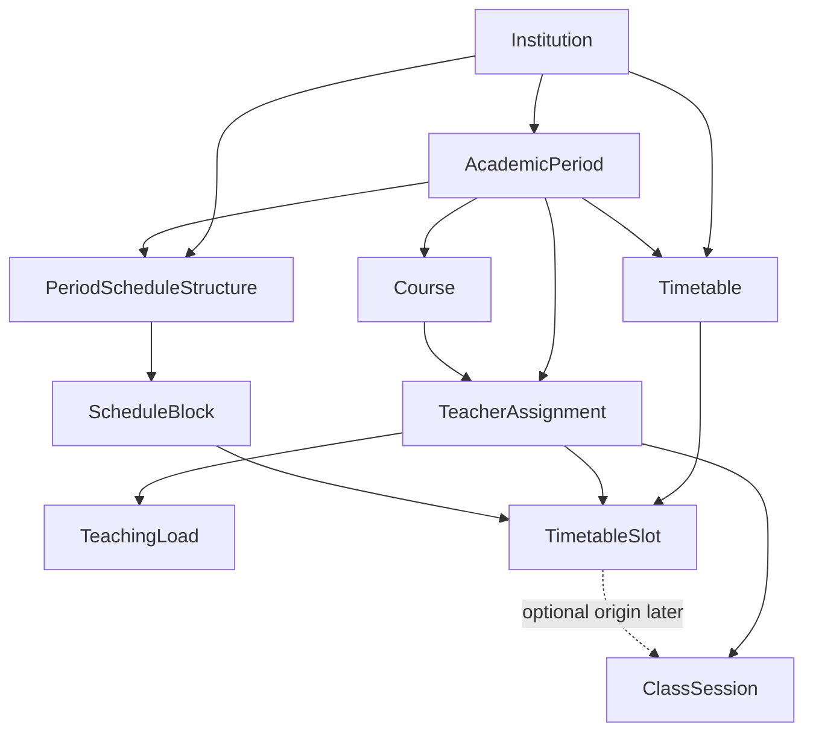

# Timetables / Scheduling MVP — architecture and product spike

Status: **domain/schema foundation implemented and deployed to Neon by DEMY-134**; API, UI, generator, and ClassSession integration remain future work.
Tracking: [DEMY-133 — Horarios académicos — Timetables / Scheduling MVP](https://emilioandresalcivarcarrera.atlassian.net/browse/DEMY-133).  
Related: [academic-planning.md](./academic-planning.md) (ClassSession execution), [teacher-assignments.md](./teacher-assignments.md), [authorization-permissions.md](./authorization-permissions.md), [ownership-strategy.md](./ownership-strategy.md).  
Deferred: [DEMY-126](https://emilioandresalcivarcarrera.atlassian.net/browse/DEMY-126) (global `User.role` → membership Role). Timetables does **not** depend on DEMY-126.

## Problem

Ecuador-oriented schools need a weekly academic timetable so administrators can place `TeacherAssignment` teaching loads into recurring day/block slots, detect conflicts immediately, publish a stable schedule, and let teachers, students, and representatives read the relevant view. Zerocademy already has staffing (`TeacherAssignment`), courses, periods, and actual execution (`ClassSession`), but no planned recurring schedule layer.

## Terminology

| Term | Meaning |
| ---- | ------- |
| **Period schedule structure** | Institution + AcademicPeriod configuration of weekdays and ordered time blocks |
| **Schedule block** | One ordered row in the day (teaching period, break, or non-teaching) |
| **Teaching load** | Required weekly teaching periods for one `TeacherAssignment` |
| **Timetable** | One weekly schedule aggregate for an institution + academic period |
| **Timetable slot** | One planned recurring placement: assignment × weekday × teaching block |
| **ClassSession** | Actual teaching occurrence (execution), not a recurring plan |

Conceptual flow (not a mandatory cascade for every session):

```text
TeacherAssignment + TeachingLoad
        ↓
PeriodScheduleStructure + ScheduleBlock
        ↓
Timetable (DRAFT → PUBLISHED)
        ↓
TimetableSlot (recurring plan)
        ↓ (optional origin)
ClassSession (actual occurrence)
```

## Product decision

MVP delivers one **institution + AcademicPeriod timetable**: ADMIN configures weekday teaching blocks and per-assignment weekly loads, runs a **deterministic in-process CSP/backtracking generator**, reviews a weekly grid, moves slots (drag-and-drop with accessible dialog), sees server-authoritative conflicts, and publishes. TEACHER sees own weekly + Today; STUDENT sees enrolled Course; REPRESENTATIVE sees linked-student Course when relationship authorization allows. SUPER_ADMIN stays platform-level and does **not** become a universal institution timetable operator. Planned slots and ClassSessions remain separate concepts; ClassSession may optionally reference a slot later without requiring bulk session materialization.

## Domain registry

| Domain | Backend | Frontend |
| ------ | ------- | -------- |
| Timetables | `timetables` | `timetables` |

Maps to root `agent.md` registry. Does not replace Academic Planning (`AcademicPlan` / units / lessons) or Academic Execution (`ClassSession`).

## Domain model

### Ownership and scope

| Entity | Owner / scope | Notes |
| ------ | ------------- | ----- |
| `PeriodScheduleStructure` | `institutionId` + `academicPeriodId` (unique) | Period-scoped: hours and blocks change by school year |
| `ScheduleBlock` | Parent structure | Ordered; typed teaching vs break |
| `TeachingLoad` | 1:1 `TeacherAssignment` | Scheduling concern; keeps staffing model clean |
| `Timetable` | `institutionId` + `academicPeriodId` (unique in MVP) | One live aggregate per period |
| `TimetableSlot` | Parent `Timetable` | References `TeacherAssignment` + `ScheduleBlock` + weekday |

### Persisted domain entities (DEMY-134 foundation)

```text
PeriodScheduleStructure
  id, institutionId, academicPeriodId
  // MVP: single structure per institution+period (covers one jornada grid)
  // Optional label later: MATUTINA | VESPERTINA | UNICA
  @@unique([institutionId, academicPeriodId])

ScheduleBlock
  id, structureId, position (Int), name?
  startTime (TIME), endTime (TIME)
  kind: TEACHING | BREAK | NON_TEACHING
  @@unique([structureId, position])

TeachingLoad
  id, teacherAssignmentId (unique)
  weeklyPeriods (Int, > 0)
  // Future: preferredDays, avoidBlocks, doublePeriodHints — not MVP columns

Timetable
  id, institutionId, academicPeriodId
  status: DRAFT | PUBLISHED
  version (Int)                 // optimistic concurrency
  publishedAt?, publishedByUserId?
  createdAt, updatedAt
  @@unique([institutionId, academicPeriodId])

TimetableSlot
  id, timetableId
  teacherAssignmentId
  scheduleBlockId
  dayOfWeek: MON..FRI (or 1..5; fixed enum)
  // Denormalized for DB hard uniqueness (validated to match assignment):
  teacherId (TeacherProfile.id)
  courseId
  createdAt, updatedAt
  @@unique([timetableId, dayOfWeek, scheduleBlockId, teacherId])   // teacher conflict
  @@unique([timetableId, dayOfWeek, scheduleBlockId, courseId])    // course conflict
  @@unique([timetableId, teacherAssignmentId, dayOfWeek, scheduleBlockId])
  @@index([timetableId, teacherId, dayOfWeek])
  @@index([timetableId, courseId, dayOfWeek])
  @@index([teacherAssignmentId])
```

### Derivation rules

- Subject, teacher display, course, institution, and period are **derived from `TeacherAssignment`** (and its relations). Do not store independent subject FKs on slots.
- `teacherId` / `courseId` on slots exist only to enforce uniqueness and fast conflict indexes; writes must reject mismatch with the assignment.
- Breaks and non-teaching blocks never receive slots.

### Relationship diagram



Dashed ClassSession link is optional and deferred to the ClassSession integration ticket. Solid edges are MVP ownership/configuration relationships.

## Scheduling configuration

### Smallest useful model

| Concept | MVP | Rationale |
| ------- | --- | --------- |
| School days | Yes (subset of Mon–Fri) | Ecuador weekly grids are weekday-based |
| Block start/end | Yes | Needed for Today and display |
| Ordered periods/blocks | Yes | Grid rows |
| Breaks / non-teaching | Yes (kind enum) | Prevents placing classes in recess |
| School start/end as separate fields | No | Derived from first/last block |
| Jornada / multi-shift | Post-MVP | One structure per institution+period covers typical single-jornada MVP; multi-jornada can add a shift discriminator later |
| Rooms / campuses | Post-MVP | Not required for correctness of teacher/course placement |

### Scope choice: Institution + AcademicPeriod

Configuration belongs to **`institutionId` + `academicPeriodId`**, not Institution alone:

1. Block times and teaching days commonly change between school years.
2. Courses and `TeacherAssignment` are already period-scoped; the timetable must align with the same period.
3. Institution-only config would force awkward copy-forward and mismatch with closed periods.

Copy-from-previous-period is a post-MVP convenience, not a schema requirement.

## Teaching load model

**Dedicated `TeachingLoad` (1:1 with `TeacherAssignment`)**, not a column forced into staffing CRUD as the only representation.

| Option | Decision |
| ------ | -------- |
| Column on `TeacherAssignment` | Rejected as sole model — mixes staffing with scheduling policy |
| Dedicated `TeachingLoad` | **Chosen** — explicit scheduling input; future preferences attach here |
| Free-floating scheduling entity unrelated to assignment | Rejected — assignment already is the staffing identity |

MVP fields: `weeklyPeriods` only. Double periods, variable loads, and preferences are documented as future soft/hard extensions on this entity without implementing them now.

Generation includes only assignments that have a `TeachingLoad` and belong to the timetable’s institution/period. Assignments without load are ignored (not errors) unless product later requires “all assignments must have load.”

## Lifecycle

| Status | Allowed |
| ------ | ------- |
| `DRAFT` | Configure loads/structure, generate, regenerate, create/move/delete slots, validate conflicts |
| `PUBLISHED` | Visible to TEACHER / STUDENT / REPRESENTATIVE read APIs; slot mutation and regenerate blocked |

**Editing published timetables (MVP choice B):** require explicit **return to DRAFT** (`unpublish`) before further generation or structural slot edits. No version history table. Publish records `publishedAt` / `publishedByUserId`. Unpublish clears publication metadata and sets `DRAFT`.

Rationale: simplest safe model; avoids accidental wipe of the live school schedule; mirrors AcademicPlan “publish then immutable until deliberate reopen” without inventing full versioning.

Closed/archived academic periods: treat timetable writes as read-only (same family of rules as ClassSession / attendance).

## Hard constraints

Enforced by generator and conflict engine (backend authoritative):

| Code | Rule |
| ---- | ---- |
| `TEACHER_CONFLICT` | Same `teacherId` cannot occupy two slots in the same `(dayOfWeek, scheduleBlockId)` within a timetable |
| `COURSE_CONFLICT` | Same `courseId` cannot occupy two slots in the same `(dayOfWeek, scheduleBlockId)` |
| `INVALID_BLOCK` | Slot block must be `TEACHING` and belong to the timetable’s period structure |
| `INVALID_DAY` | Weekday not enabled on the structure |
| `LOAD_UNSATISFIED` | After generation or as validation report: placed slots for an assignment ≠ `weeklyPeriods` |
| `LOAD_OVERSATISFIED` | Manual edits must not exceed `weeklyPeriods` for an assignment |
| `CONTEXT_MISMATCH` | Assignment / block / course / institution / period inconsistency |

Additional MVP hard constraints:

- Timetable institution/period must match structure and all referenced assignments.
- Only one slot per `(timetable, assignment, day, block)` (no duplicate cell for same assignment).

Preferences (gap minimization, distribution, consecutive limits) are **not** hard constraints.

## Soft constraints (post-MVP / future optimizer inputs)

- Minimize teacher gaps
- Spread a subject across the week
- Cap consecutive periods
- Teacher preferred hours/days
- Morning/afternoon preference
- Double-period adjacency
- Balance daily load per course

Document only; do not implement in MVP generation scoring unless a trivial deterministic tie-break is free (e.g. stable sort by assignment id).

## Generator strategy

### Options considered

| Approach | Fit for Zerocademy |
| -------- | ------------------ |
| Deterministic greedy only | Simple, but may fail when a valid packing exists |
| Pure TS CSP / backtracking | Fits NestJS, deterministic, explainable, no native deps |
| OR-Tools / external solver | Stronger optimization; heavier ops/deps for current stack |
| LLM | Forbidden for generation |

### Choice

**Deterministic constraint satisfaction with backtracking in pure TypeScript** inside the `timetables` module (no OR-Tools, no LLM).

Why:

1. Typical Ecuador school sizes (tens of courses/assignments, ~5×6–8 cells) are tractable.
2. Reproducible QA: fixed variable order (e.g. assignments by descending load, then id; values by day×block lexical order).
3. Failure can list remaining unplaced load units and blocking constraint codes.
4. Soft constraints can later become scored heuristics without replacing the hard CSP core.

### Failure behavior

If hard constraints cannot all be satisfied, **do not persist a partial replacement**. Return `409`/`422` with structured payload, for example:

```json
{
  "code": "TIMETABLE_GENERATION_FAILED",
  "unsatisfiedLoads": [{ "teacherAssignmentId": "...", "required": 5, "placed": 3 }],
  "blockingConflicts": [{ "code": "TEACHER_CONFLICT", "teacherId": "...", "dayOfWeek": "MON", "scheduleBlockId": "..." }]
}
```

### Generation transaction

1. Load structure, teaching loads, and draft timetable under optimistic `version`.
2. Solve entirely in memory.
3. On success, in one DB transaction: delete existing draft slots for that timetable, insert new slots, increment `version`.
4. On failure or stale `version`: no slot writes; return structured error / `409`.

No temporary proposal table in MVP.

## Conflict model

Reusable server service (e.g. `TimetableConflictEngine`) used by generate, create, move, and validate endpoints.

Suggested response fragment:

```ts
type TimetableConflict = {
  code:
    | 'TEACHER_CONFLICT'
    | 'COURSE_CONFLICT'
    | 'INVALID_BLOCK'
    | 'INVALID_DAY'
    | 'LOAD_UNSATISFIED'
    | 'LOAD_OVERSATISFIED'
    | 'CONTEXT_MISMATCH';
  message: string;
  teacherAssignmentId?: string;
  teacherId?: string;
  courseId?: string;
  dayOfWeek?: string;
  scheduleBlockId?: string;
  conflictingSlotId?: string;
};
```

Frontend may pre-check for UX; backend remains source of truth.

## ClassSession integration

| Decision | Detail |
| -------- | ------ |
| Concepts stay separate | Slot = recurring plan; ClassSession = actual occurrence |
| Optional FK | Future `ClassSession.timetableSlotId?` with `onDelete: SetNull` |
| Not required | Manual, exceptional, rescheduled, and unplanned sessions remain valid with null origin |
| No bulk materialization | Do not pre-create ClassSessions for the whole year in MVP |
| History safety | Session keeps its own `scheduledDate` / status; timetable edits after the fact must not rewrite historical sessions; deleted slots null the optional FK |

**MVP vs later:**

- **In Timetables MVP:** published slot reads; teacher Today list from published slots for current weekday (and clock).
- **Integration ticket:** optional `timetableSlotId`, “start/open ClassSession from Today,” link to existing session for that assignment+date if present.

## Authorization

Use current transitional model: **legacy role/scope AND membership-aware permission enforcement** where institutional ADMIN/TEACHER apply. DEMY-126 remains deferred; global `User.role` stays authoritative for role ceilings.

### Proposed catalog keys (naming aligned with `module.action`)

```text
timetables.read
timetables.configure   // structure + teaching loads
timetables.update      // slot mutations while DRAFT
timetables.generate
timetables.publish     // publish + unpublish
```

### Role ceilings (intended)

| Role | Capabilities | Resource scope |
| ---- | ------------ | -------------- |
| ADMIN | read, configure, update, generate, publish | Active institution membership |
| TEACHER | read | Own `TeacherAssignment` slots only |
| STUDENT | read | Active enrollment Course timetable |
| REPRESENTATIVE | read | Linked student Course via existing representative authorization |
| SUPER_ADMIN | read (platform inspection only) | Not institution operational manage/generate/publish |

Do not grant SUPER_ADMIN `timetables.configure|update|generate|publish` merely for platform role. Implementation ticket must seed catalog + baselines; this spike does not modify code.

## API direction (indicative)

Base: `/v1/timetables` and related resources (final paths locked in implementation tickets).

| Area | Examples |
| ---- | -------- |
| Structure | `GET/PUT /v1/period-schedule-structures?institutionId&academicPeriodId` |
| Loads | `GET/PUT /v1/teaching-loads` (by period / assignment) |
| Aggregate | `GET /v1/timetables?institutionId&academicPeriodId` (get-or-create DRAFT for ADMIN) |
| Generate | `POST /v1/timetables/:id/generate` + `If-Match` / `version` |
| Slots | `POST .../slots`, `PATCH .../slots/:slotId/move`, `DELETE .../slots/:slotId` |
| Lifecycle | `POST .../publish`, `POST .../unpublish` |
| Teacher | `GET /v1/timetables/me`, `GET /v1/timetables/me/today` |
| Student | `GET /v1/timetables/me/course` |
| Representative | `GET /v1/timetables/linked-students/:studentProfileId` |

All lists paginated where collections are unbounded; weekly grids may return a bounded slot array for one timetable.

## Frontend UX

### ADMIN

Routes under `/timetables` (feature `timetables`):

1. Configuration — days + ordered blocks + teaching loads for period assignments  
2. Generator — run, show success or structured failure  
3. Weekly editor — **course-oriented grid** primary; optional teacher-oriented toggle  
4. Publish / return to draft  

Grid: **columns = enabled weekdays**, **rows = TEACHING blocks** (show break rows as non-drop targets). Slot cards show subject + teacher (course view) or subject + course (teacher view).

Drag-and-drop: pointer DnD acceptable; **must** offer Move/Edit dialog (select day + block) for accessibility. Prefer no new dependency initially; introduce `@dnd-kit` only if native DnD fails keyboard/a11y acceptance. Updates are **confirm-on-drop** (call move API); on conflict, revert UI from server state and show conflict codes. Loading/error/empty states required; Spanish UI copy.

### TEACHER

- `/timetables/me` weekly  
- `/timetables/me/today` lightweight list (time — subject — course) with eventual link toward execution (integration ticket)

### STUDENT / REPRESENTATIVE

- Read-only course weekly view; representative picks linked student when multiple

## Scope and IDOR (future tests)

| Case | Expected |
| ---- | -------- |
| Cross-institution timetable id | 404 |
| Period mismatch (structure vs assignment) | 400/422 |
| Teacher B reads Teacher A slots via me endpoints | empty / 404, never foreign slots |
| Student reads other course timetable | denied |
| Representative without active link | denied |
| SUPER_ADMIN mutate institution timetable | denied by strict role / missing manage permissions |
| Move slot referencing foreign block/assignment | CONTEXT_MISMATCH |
| Publish while stale version | 409 |

## Data integrity

| Concern | Enforcement |
| ------- | ----------- |
| Teacher/block collision | DB unique on denormalized `(timetableId, day, block, teacherId)` + engine |
| Course/block collision | DB unique on `(timetableId, day, block, courseId)` + engine |
| Duplicate assignment cell | DB unique on `(timetableId, assignment, day, block)` |
| Teaching-only placement | Service + `INVALID_BLOCK` |
| Load counts | Service validation (not a single DB constraint) |
| Lifecycle | Service gates on `DRAFT`/`PUBLISHED` |
| Indexes | teacher/day, course/day, assignment, timetable |

PostgreSQL uniqueness cannot express “load count = N” or “block kind is TEACHING” without triggers; keep those in the transactional service.

## Concurrency

MVP strategy: **optimistic concurrency via `Timetable.version`**.

- Every mutating request sends expected `version` (body or header).
- Stale version → `409` with current version; client reloads.
- Generation and publish are versioned mutations (no distributed locks).
- Two ADMINs editing: last successful version wins; loser retries after refresh.

## QA strategy

Use local Docker QA (`qa/qa-users.local.json`, `npm run qa:setup`). Deterministic generator seeds fixed assignment/load/block fixtures.

Scenarios for later tickets/tests:

- Successful generation satisfying all loads  
- Teacher collision (manual and generate)  
- Course collision  
- Impossible load (more periods than cells available)  
- Deterministic repeat (same inputs → same slot set)  
- Manual move success / conflict  
- Publish + visibility for teacher/student/representative  
- Unauthorized teacher / A vs B isolation  
- Student course isolation  
- Representative linked-student isolation  
- Cross-institution IDOR  
- Period mismatch  
- Stale version concurrent edit  

Do not run the full campaign in this spike.

## MVP boundaries

### IN MVP

- Period schedule structure + teaching/break blocks  
- Teaching loads per assignment  
- One timetable per institution+period  
- DRAFT/PUBLISHED + unpublish-to-edit  
- Hard-constraint conflict engine  
- Deterministic TS CSP generator with transactional slot replace  
- ADMIN weekly course grid + accessible move + optional teacher view  
- Teacher weekly + Today (slot list)  
- Student + representative published reads  
- Permission catalog keys + legacy AND membership enforcement pattern  
- Optimistic `version` concurrency  

### POST-MVP

- Rooms / resources / campuses  
- Multi-jornada structures  
- Teacher availability & preferences  
- Substitutes / exceptional-day calendars  
- Soft-constraint optimizer / gap minimization / max consecutive  
- Complex double-block rules  
- Timetable history / version comparison  
- Notifications  
- Automatic rescheduling  
- Bulk ClassSession materialization  
- DEMY-126 membership Role migration  

## Future evolution

1. Attach soft scores to the CSP value ordering.  
2. Optional shift discriminator on `PeriodScheduleStructure`.  
3. ClassSession Today → create/link session with `timetableSlotId`.  
4. Session/subject attendance remains a separate attendance design (already split from daily attendance).

## Implementation ticket order

1. Domain/schema foundation  
2. Schedule structure API  
3. Teaching load API  
4. Conflict engine  
5. Automatic generator  
6. Admin timetable API/lifecycle  
7. Admin weekly UI + editing  
8. Publication + audience visibility gates  
9. Teacher timetable / Today  
10. Student/representative reads  
11. ClassSession optional integration  
12. QA / security hardening  

See DEMY epic children for acceptance criteria.
